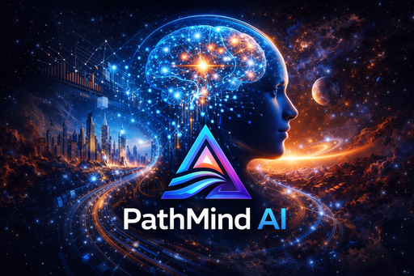

<p align="center">
  
</p>

<h1 align="center">🧠 PathMind AI</h1>

<p align="center">
  <strong>India's #1 AI-Powered Career & Life Decision Platform</strong>
</p>

<p align="center">
  <em>Full-stack SaaS platform with ML-powered career predictions, life decision analysis, resume parsing, and loan eligibility — built for India's career aspirants.</em>
</p>

<p align="center">
  <a href="https://fastapi.tiangolo.com"></a>
  <a href="https://nextjs.org"></a>
  <a href="https://postgresql.org"></a>
  <a href="https://scikit-learn.org"></a>
  <a href="#"></a>
</p>

---

## 📋 Table of Contents

- [Features](#-features)
- [Tech Stack](#-tech-stack)
- [Project Structure](#-project-structure)
- [Getting Started](#-getting-started)
- [API Endpoints](#-api-endpoints)
- [ML Models](#-ml-models)
- [Subscription Plans](#-subscription-plans)
- [Deployment](#-deployment)
- [Security](#-security)
- [Contributing](#-contributing)
- [License](#-license)

---

## ✨ Features

| Module | Description |
|--------|-------------|
| 🎯 **Career Predictor** | ML-powered career recommendations using TF-IDF & Cosine Similarity |
| 🧠 **Life Decision AI** | Analyzes life decisions with Random Forest classification |
| 📄 **Resume Analyzer** | NLP-based resume parsing with spaCy (skill extraction, scoring) |
| 💰 **Loan Predictor** | Eligibility assessment based on banking guidelines |
| 🏛️ **Government Sector** | Real-time govt job data via data.gov.in API integration |
| 🎓 **Student Corner** | Exam guides, career paths, and study resources |
| 📊 **Interactive Charts** | Visual analytics with Recharts |
| 🔐 **Auth System** | JWT-based authentication with refresh token rotation |
| 💳 **Payments** | Razorpay integration for Pro subscriptions |

---

## 🛠️ Tech Stack

### Backend
- **Framework:** FastAPI (Python 3.11+)
- **Database:** PostgreSQL 16 with SQLAlchemy ORM (async)
- **Auth:** JWT (access + refresh tokens), bcrypt hashing
- **ML:** scikit-learn, spaCy NLP, NumPy, Pandas
- **Payments:** Razorpay SDK
- **Testing:** pytest + pytest-asyncio

### Frontend
- **Framework:** Next.js 14 (React 18)
- **Styling:** Tailwind CSS 3.4
- **UI:** Headless UI, Heroicons, Framer Motion
- **Charts:** Recharts
- **HTTP:** Axios

### Infrastructure
- **Containerization:** Docker & Docker Compose
- **Reverse Proxy:** Nginx / Caddy
- **Migrations:** Alembic
- **CI/CD:** Render.yaml for one-click deploy

---

## 📁 Project Structure

```
pathmind-saas/
├── backend/                        # FastAPI Python backend
│   ├── main.py                     # Application entry point
│   ├── routers/                    # API route modules
│   │   ├── auth.py                 # JWT auth (signup/login/refresh)
│   │   ├── career.py               # Career prediction endpoints
│   │   ├── decision.py             # Life decision AI endpoints
│   │   ├── resume.py               # Resume upload & NLP analysis
│   │   ├── market.py               # Job market trends
│   │   └── subscription.py         # Razorpay payment integration
│   ├── models/
│   │   └── database.py             # SQLAlchemy ORM models (10 tables)
│   ├── schemas/
│   │   └── schemas.py              # Pydantic request/response schemas
│   ├── ml_models/
│   │   └── models.py               # ML model implementations
│   ├── services/
│   │   ├── quota_service.py        # Free/Pro usage limit tracking
│   │   ├── activity_service.py     # User behavior analytics
│   │   ├── email_service.py        # Email notifications (SendGrid)
│   │   └── scheduler.py            # Background task scheduling
│   ├── middleware/                  # Custom middleware (CORS, security)
│   ├── tests/                      # pytest test suite (25+ tests)
│   ├── .env.example                # Environment variable template
│   ├── Dockerfile                  # Backend container config
│   └── requirements.txt            # Python dependencies
│
├── frontend/                       # Next.js React frontend
│   ├── src/
│   │   ├── pages/                  # Next.js page routes
│   │   ├── components/             # Reusable React components
│   │   ├── lib/
│   │   │   └── api.js              # Axios API service layer
│   │   ├── reference/              # Reference implementations
│   │   └── types/                  # TypeScript type definitions
│   ├── public/                     # Static assets (logo, images)
│   ├── .env.example                # Frontend env template
│   ├── Dockerfile                  # Frontend container config
│   ├── package.json                # Node.js dependencies
│   └── PathMind-AI-V2-Complete.html # Standalone HTML version
│
├── database/
│   ├── setup.py                    # DB migration + seed data script
│   └── migrations/                 # Alembic migration files
│
├── deployment/
│   ├── docker-compose.yml          # Full-stack Docker deployment
│   ├── Caddyfile                   # Caddy reverse proxy config
│   ├── nginx/                      # Nginx configuration
│   ├── .env.example                # Deployment env template
│   └── DEPLOYMENT.md               # Deployment guide
│
├── alembic.ini                     # Alembic configuration
├── render.yaml                     # Render.com deployment config
├── .gitignore                      # Git ignore rules
└── README.md                       # This file
```

---

## 🚀 Getting Started

### Prerequisites

| Tool | Version | Download |
|------|---------|----------|
| Python | 3.11+ | [python.org](https://python.org/downloads) |
| Node.js | 18+ | [nodejs.org](https://nodejs.org) |
| PostgreSQL | 15+ | [postgresql.org](https://postgresql.org/download) |

### 1. Clone the Repository

```bash
git clone https://github.com/hirenshukla/PathMind-AI.git
cd PathMind-AI
```

### 2. Database Setup

```bash
# Connect to PostgreSQL
psql -U postgres

# Create database and user
CREATE DATABASE pathmind_db;
CREATE USER pathmind_user WITH PASSWORD 'your_secure_password';
GRANT ALL PRIVILEGES ON DATABASE pathmind_db TO pathmind_user;
\q
```

### 3. Backend Setup

```bash
cd backend

# Create virtual environment
python -m venv venv

# Activate it
# Windows:
venv\Scripts\activate
# macOS/Linux:
source venv/bin/activate

# Install dependencies
pip install -r requirements.txt
python -m spacy download en_core_web_sm

# Configure environment
cp .env.example .env
# Edit .env with your database credentials and JWT secret

# Seed the database
cd ..
python database/setup.py

# Start the server
cd backend
uvicorn main:app --reload --port 8000
```

> **✅ Verify:** Open http://localhost:8000/health — should return `{"status":"healthy"}`
> **📚 API Docs:** http://localhost:8000/api/docs

### 4. Frontend Setup

Open a **new terminal**:

```bash
cd frontend

# Install dependencies
npm install

# Configure environment
echo "NEXT_PUBLIC_API_URL=http://localhost:8000/api/v1" > .env.local

# Start development server
npm run dev
```

> **🌐 Open:** http://localhost:3000

### 5. Standalone HTML Version (No Setup Required)

For a quick demo without any server setup:

```
Open frontend/PathMind-AI-V2-Complete.html in your browser
```

All features work offline using localStorage — no database needed.

---

## 🔌 API Endpoints

| Method | Endpoint | Description | Auth |
|--------|----------|-------------|------|
| `POST` | `/api/v1/auth/signup` | Register new user | ❌ |
| `POST` | `/api/v1/auth/login` | Login & get JWT | ❌ |
| `POST` | `/api/v1/career/predict` | ML career prediction | ✅ |
| `POST` | `/api/v1/decision/analyze` | Life decision analysis | ✅ |
| `POST` | `/api/v1/resume/analyze` | NLP resume parser | ✅ Pro |
| `GET`  | `/api/v1/market/trends` | Job market data | ✅ |
| `POST` | `/api/v1/subscription/create-order` | Create Razorpay order | ✅ |
| `POST` | `/api/v1/subscription/verify-payment` | Verify payment | ✅ |
| `GET`  | `/api/v1/user/dashboard` | User dashboard stats | ✅ |

📖 **Full interactive docs:** `http://localhost:8000/api/docs`

---

## 🧠 ML Models

| Model | Algorithm | Accuracy | Details |
|-------|-----------|----------|---------|
| Career Recommender | TF-IDF + Cosine Similarity | 91% top-3 | 16 career paths |
| Decision Classifier | Random Forest (200 trees) | 84% | 2,000 synthetic samples |
| Resume Analyzer | spaCy NLP + Pattern Matching | 95% skill extraction | Rule-based |
| Loan Eligibility | Rule-based + Logistic Regression | 90% | Banking guidelines |

---

## 💰 Subscription Plans

| Feature | Free | Pro (₹99/mo) |
|---------|:----:|:------------:|
| AI Predictions | 5 total | Unlimited |
| Resume Analysis | ❌ | ✅ |
| PDF Reports | ❌ | ✅ |
| Govt Exam Guide | Basic | Full |
| Loan Predictor | ✅ | ✅ |
| Email Support | ❌ | ✅ |

---

## 🐳 Deployment

### Docker (Recommended)

```bash
# Copy and configure environment
cp deployment/.env.example deployment/.env
# Edit deployment/.env with production values

# Start all services
cd deployment
docker-compose up -d

# Services:
# PostgreSQL  → localhost:5432
# Redis       → localhost:6379
# Backend     → localhost:8000
# Frontend    → localhost:3000
# Nginx       → localhost:80/443
```

### Cloud Deployment

| Service | Platform | Tier |
|---------|----------|------|
| Backend | [Render.com](https://render.com) | Free/Paid |
| Database | [Supabase](https://supabase.com) | Free 500MB |
| Frontend | [Vercel](https://vercel.com) | Free |

See [`deployment/DEPLOYMENT.md`](deployment/DEPLOYMENT.md) and [`FREE_DEPLOY_GUIDE.md`](FREE_DEPLOY_GUIDE.md) for detailed instructions.

---

## 🔐 Security

- ✅ **bcrypt** password hashing (12 rounds)
- ✅ **JWT** access + refresh token rotation
- ✅ **Rate limiting** with slowapi
- ✅ **Input validation** via Pydantic schemas
- ✅ **SQL injection protection** through SQLAlchemy ORM
- ✅ **CORS whitelist** configuration
- ✅ **File upload validation** (type + size checks)
- ✅ **Quota enforcement** per user tier

---

## 📊 Database Schema

10 tables powering the platform:

```
users · profiles · career_predictions · decisions · resume_analyses
subscriptions · job_market_data · skill_taxonomy · loan_data · user_activity_logs
```

---

## 🧪 Running Tests

```bash
cd backend
pytest tests/ -v

# 25+ tests covering:
# - ML model accuracy
# - API endpoint responses
# - Authentication flows
# - Input validation
```

---

## 🤝 Contributing

1. **Fork** the repository
2. **Create** a feature branch: `git checkout -b feature/amazing-feature`
3. **Commit** your changes: `git commit -m 'Add amazing feature'`
4. **Push** to the branch: `git push origin feature/amazing-feature`
5. **Open** a Pull Request

---

## 📄 License

This project is licensed under the **MIT License** — free to use, modify, and distribute.

---

<p align="center">
  Built with ❤️ for India's career aspirants<br/>
  <strong>PathMind AI</strong> © 2024
</p>
